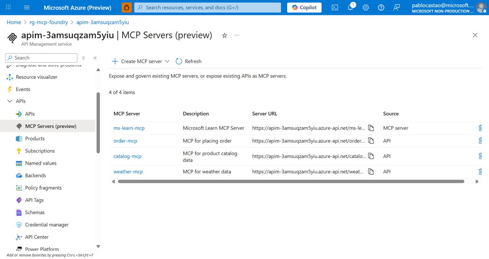

# Azure AI Foundry Agents with MCP Tools registerd in Azure API Management

### 📋 Description

This repository exemplifies how to use [Azure API Management](https://learn.microsoft.com/en-us/azure/api-management/api-management-key-concepts) to register [MCP servers](https://modelcontextprotocol.io/docs/getting-started/intro) and configure [Azure AI Foundry Agents](https://learn.microsoft.com/en-us/agent-framework/user-guide/agents/agent-types/azure-ai-foundry-agent?pivots=programming-language-python) as MCP clients . This setup enables seamless integration between AI agents and external tools/data sources through standardized MCP protocols, providing a scalable and manageable approach to agent-tool communication.


## 🔧 Prerequisites

+ [azd](https://learn.microsoft.com/azure/developer/azure-developer-cli/install-azd), used to deploy all Azure resources and assets used in this sample.
+ [PowerShell Core pwsh](https://github.com/PowerShell/powershell/releases) if using Windows
+ [Python 3.11](https://www.python.org/downloads/release/python-3110/)
+  [An Azure Subscription](https://azure.microsoft.com/free/) with Contributor permissions
+  [Sign in to Azure with Azure CLI](https://learn.microsoft.com/cli/azure/authenticate-azure-cli-interactively)
+  [VS Code](https://code.visualstudio.com/) installed with the [Jupyter notebook extension](https://marketplace.visualstudio.com/items?itemName=ms-toolsai.jupyter) enabled

## 🏗️ Architecture


## ⚙️ Set Up

This sample uses [`azd`](https://learn.microsoft.com/azure/developer/azure-developer-cli/) and a bicep template to deploy all Azure resources:

1. **Python Environment Setup**
   ```bash
   python3.11 -m venv .venv
   source .venv/bin/activate  # On Windows: .venv\Scripts\activate
   pip install -r requirements.txt
   ```

2. **Create the infrastructure**
   ```bash
   # Login to Azure (if not already logged in)
   az login

   # Initialize the project (if running for the first time)
   azd init

   # Deploy infrastructure and application to Azure
   azd up
   ```
   
   After running, an `.env` file will be created with all necessary environment variables

## 🎤 Chat with the agent
   ```bash
   source .venv/bin/activate
   python src/main.py  
   ```

Ask questions like `What's the weather in Lisbon, Cairo and London?` 

## 👁️ Observe with Azure AI Foundry Observe with Azure AI Foundry

Navigate to your Azure AI Foundry resource in the Azure portal to monitor and analyze your agent's behavior:

1. **Access Azure AI Foundry**: Go to the Azure portal and locate your AI Foundry resource deployed by `azd`

2. **View Agent Activity**: 
    - Navigate to the **Agents** section to see your deployed 
    agent
    - Click on your agent to view its configuration

3. **Monitor Conversations**:
    - Go to the **Threads** section to see all conversation sessions
    - Select a specific thread to examine the conversation flow and agent responses

4. **Analyze in Playground**:
    - Click **Try in Playground** to test and debug your agent interactively

5. **Look at the Thread logs**:
    - Access **Thread logs** to examine the detailed step-by-step execution trace.


The observability features show the complete step-by-step execution flow.

## 🔍 Discover

### View MCP Servers in Azure API Management

The MCP servers deployed in this sample are automatically registered in Azure API Management, providing centralized management and monitoring capabilities:

1. **Access API Management**: Navigate to your API Management instance in the Azure portal (deployed by `azd`)

2. **View Registered MCP**: 
    - Go to the **MCP Servers** section in the left navigation
    - You'll see the MCP servers listed
    - Each MCP server appears with its configured endpoints and source


4. **Monitor API Usage**:
    - Navigate to **Analytics** to view request metrics and performance data
    - Monitor API calls made by Azure AI Foundry agents to the MCP servers

5. **API Policies and Security**:
    - Review applied policies for authentication, rate limiting, and transformation
    - Check security configurations and access controls



This integration provides enterprise-grade API management for your MCP servers, including versioning, security, and observability.

## 💣 **Delete the Resources**
   ```bash
   azd down --purge
   ```